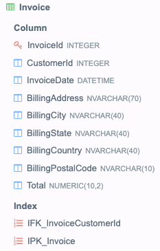

## Продажи

В базе данных есть таблица Invoice следующего вида:

Напишите запрос, который покажет общие продажи по всем странам, отсортированным в порядке возрастания. На выходе в первой колонке должно быть название страны, а во второй показатель общих продаж.

Примечание
Для решения задачи используется база данных Chinook Database в формате Sqlite - см. файл  Chinook_Sqlite.sqlite.
